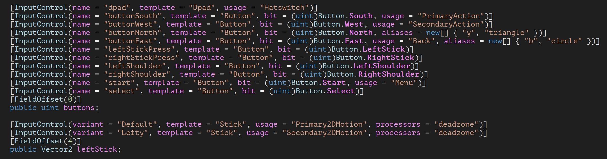

>Note that for most use cases of the input system, it is not necessary to be aware of layouts and of what they do. Understanding layouts is necessary for authoring support for new devices but is not necessary for using already existing support of devices. When authoring new layouts, understanding the [state system](Input-State) can be helpful.

# What do they do?

They tell the system how to represent input devices. Specifically, they describe the arrangement of hierarchies of input controls and the correlation of those controls to input state stored in raw memory.

Example: the "Stick" layout creates a hierarchy with a `StickControl` at the top, six `AxisControls` underneath ('left', 'right', 'top', 'down', 'x', and 'y'), and a default state of two floats with 'left', 'right' and 'x' reading from the first float and 'top', 'down', and 'y' reading from the second float.


When a device is plugged into the system, it looks for a matching layout that can be used with the device. This is done by looking at the `InputDeviceDescription` provided for the device by the input runtime (`IInputRuntime`) and comparing it with the descriptions associated with the various layouts that have been registered. Also, there is a callback `InputSystem.onFindControlLayoutForDevice` that can be used to programmatically alter the matching logic. If a matching layout is found, it is "instantiated", i.e. turned into an actual `InputDevice` instance by `InputControlSetup`.

To look at all the layouts that are registered in the system, open the Input Debugger (`Window >> Input Debugger`) and look under the "Control Layouts" section.


Layouts are also used for being able to create input devices that do not exist locally. A player connected to the editor will send all its layouts to the editor and then instruct the editor which layouts to instantiate devices from. This allows the editor to replicate devices with the exact same memory layouts they have in the player and thus consume input events directly from the player.

# How do I create them?

In one of three ways:

1. C# reflection
2. JSON
3. Manual C# construction code

All three ways produce the same format: an instance of `InputControlLayout`. These are created on the fly and on demand during control creation and then thrown away.

Any `InputControlLayout`, regardless of which way it was created, can be turned back into JSON. This is used for sending layouts over the wire (e.g. when debugging player input in the editor).

Note that for layouts to be seen by the system, they have to be explicitly registered.

1. To register C# types as layouts, use `InputSystem.RegisterControlLayout<T>(string)`.
2. To register a JSON layout, use `InputSystem.RegisterControlLayout(string, string).`
3. To register a manual layout builder, use `InputSystem.RegisterControlLayoutConstructor`.

## C# Reflection

When registering a C# class as a layout with `InputSystem.RegisterControlLayout<T>`, reflection is used to automatically discover the control setup of the given class. Two attributes -- `InputControlLayoutAttribute` and `InputControlAttribute` -- can be used to guide and supplement this process.

>NOTE: If `T` is directly or indirectly derived from a type that is itself registered as a layout, that layout is taken as a base layout for `T`. I.e. the layout for `T` will inherit all the settings of the existing layout and merge its own settings on top.

In this process the code goes looking through all properties and fields of the class (directly declared *and* inherited ones) and for each one that classifies as an `InputControl`, adds information about the control to the layout. Every field or property that either has a type derived from `InputControl` or has an `InputControlAttribute` applied to it classifies.



Defaults for the control added to the layout are taken from the property or field. All defaults can be overridden with explicit settings in `InputControlAttribute`.

- `name` defaults to the name of the property or field.
- `layout` defaults to what is inferred from the type of the field. If the type name ends in "Control", the suffix is removed and the resulting name taken as the name of the layout ("ButtonControl" -> "Button"). Otherwise, if the type is not a primitive type, the name of the type is taken as the name of the layout as is. If the the type is a primitive type, no layout name is inferred. (`////REVIEW: The inference mechanism is questionable and likely to go away.`)
- `offset` defaults to the offset of the field (not applicable to properties).

## JSON

The JSON layout format allows authoring new layouts without writing C# code. They have the same capabilities as layouts generated from C# classes.

To determine the C# control class to create when instantiating a JSON layout, the system looks at the inheritance chain of the layout. The first layout along the chain that is generated from a C# class determines the class to instantiate. If there is no such layout in the chain, `InputDevice` is assumed.

## Manual C# Construction Code

# What do those various settings do?

## `name`

Sets the name that the control is referred to by. This is the primary name that the control is looked up with. E.g. `Gamepad.current["leftStick"]` will look for the control called "leftStick" as a child of the given `Gamepad`.

Names are case-insensitive.

Names also become the default `displayName` of the control, if no display name is set explicitly.

`aliases` provide a set of alternate names for controls.

Names have to be unique within the context of the parent control. They are used to form paths (e.g. "leftStick/x").

## `displayName`

Name to display for the control in UIs. If not set, defaults to `name`.

## `resourceName`

## `aliases`

## `layout`

The name of the layout that is instantiated to represent the control. For example, the "leftStick" control on `Gamepad` uses the "Stick" layout which automatically creates a child hiearchy with "left", "right", "up", "down", "x" and "y" child controls underneath the "leftStick" parent control.

## `offset`

Offset (in bytes) of where the control's state starts in memory. Offsets are relative to parents. For example, the following arrangement will offset `stick/y` 2 bytes from where `stick` starts (whose offset is inferred from the `stickX` field the attribute is applied to).

```
    [InputControl(name = "stick", layout = "Stick")]
    [InputControl(name = "stick/x", offset = 0, format = "SHRT")]
    [InputControl(name = "stick/y", offset = 2, format = "SHRT")]
    public short stickX;
    public short stickY;
```

## `bit`

Offset in bits from the control's byte offset. This is only relevant for bit-addressed controls (like buttons using a bitfield) and should normally be set to 0.

```
    [InputControl(name = "buttonSouth", layout = "Button", bit = (uint)Button.South)]
    [InputControl(name = "buttonWest", layout = "Button", bit = (uint)Button.West)]
    [InputControl(name = "buttonNorth", layout = "Button", bit = (uint)Button.North)]
    [InputControl(name = "buttonEast", layout = "Button", bit = (uint)Button.East)]
    public uint buttons;
```

## `sizeInBits`

Width of the control's state in memory in bits. For example, for a button stored as a single bit this would be 1. For an axis stored as a float, this would be 32.

## `format`

State format code for the memory layout of the control. This is only relevant for controls that read their memory directly which usually is the case only with leaf controls and devices. Controls sitting in the middle of the control tree usually read their state by having child controls read theirs. However, there are exceptions (like `TouchControl`, for example).

The format code is always a FourCC code.

For devices the state format code is important as it has to correspond to the format code of incoming events. Events where the format code does not match are ignored. `////REVIEW: should we abandon this mechanism?`

The following table lists the built-in state formats as well as the controls that support them. Support for arbitray formats can be added by implementing custom controls that understand the formats.

|C# Type|Format Code|Data|Supported by Controls|
|-------|----------|----|--------------------|
|n/a|`"BIT"`|Single bit|`AxisControl` (and controls derived from it, like `ButtonControl`)|
|`byte`|`"BYTE"`|Unsigned 8-bit integer value|`AxisControl` (and controls derived from it, like `ButtonControl`)|
|`sbyte`|`"SBYT"`|Signed 8-bit integer value|`AxisControl` (and controls derived from it, like `ButtonControl`)|
|`short`|`"SHRT"`|Signed 16-bit integer value|`AxisControl` (and controls derived from it, like `ButtonControl`)|
|`ushort`|`"USHT"`|Unsigned 16-bit integer value|`AxisControl` (and controls derived from it, like `ButtonControl`)|
|`int`|`"INT"`|Signed 32-bit integer value|`AxisControl` (and controls derived from it, like `ButtonControl`), `IntegerControl`|
|`uint`|`"UINT"`|Unsigned 32-bit integer value|`AxisControl` (and controls derived from it, like `ButtonControl`)|
|`float`|`"FLT"`|32-bit floating-point value|`AxisControl` (and controls derived from it, like `ButtonControl`)|
|`double`|`"DBL"`|64-bit floating-point value|

## `usages`

# How do I associate a layout with a specific type?

# How can I base one layout on an existing layout?

# How do I modify the settings of an existing layout?

# What are "variants"?

# Why can't I just add new controls in `FinishSetup`?

The most important reason is that those controls would not be discoverable without creating an instance of the device or control. The control picker in the UI when you set up an action just crawls through all the information available in the layouts and goes from that.

Another reason is that the aim for layouts is to fully describe a device and to make it possible to re-create the device (e.g. in the debugger) without any dependency on having the code. However, that is only partially the case ATM. There is some reliance on defaults set by control constructors.

Also, modifying the device in FinishSetup would lead to a somewhat circular setup. FinishSetup is called when everything on the device has been put in place. And unlike in the previous new input system, that's a more intricate process. Controls don't just sit there with their own data but an entire hierarchy shares data stored on the device. So when you insert a control, you have to reallocate and shift around arrays and update automatically computed state layouts.

Finally, allowing you to create controls like that would make some functionality tricky to support. E.g. all the merging/inheriting of settings that's going on.

The current setup has the advantage of having to support only one single way to create controls. Every control is coming from `InputDeviceBuilder` which is working off of an `InputControlLayout`.
